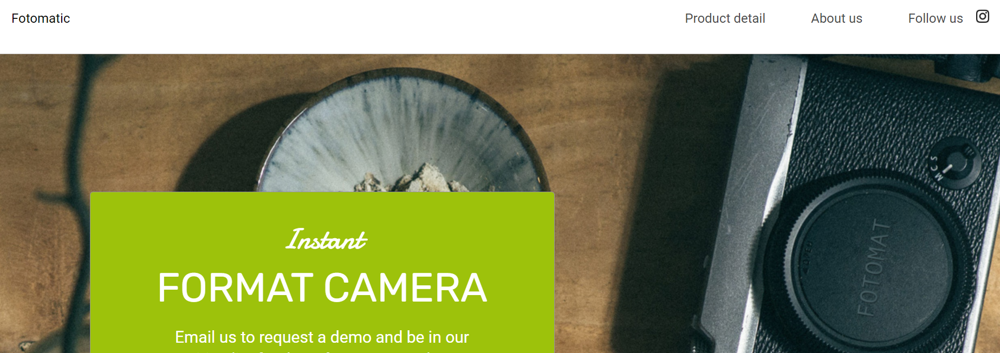
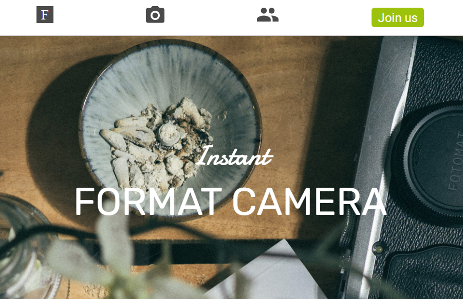

# fotomatic
> fotomatic is a responsive website I fixed up in order to test and improve my CSS skills, particularly around syntax and selectors, flexbox design, and media query skills. The source code (intentionally broken) was provided by [Codecademy](https://www.codecademy.com).

## Table of contents
* [General info](#general-info)
* [Screenshots](#screenshots)
* [Technologies](#technologies)
* [Setup](#setup)
* [Features](#features)
* [Status](#status)

## General info
Designed as a challenge project within the CSS curriculum, [Codecademy](https://www.codecademy.com) provided me source code, image resources, and specs to design the website for fotomatic. There were errors riddled throughout `index.html` and `style.css`. I corrected these errors in order to produce a responsive website that matched the specs provided.

## Screenshots
### Desktop Version

### Mobile Version


## Technologies
* HTML5
* CSS3

## Setup
You can see the completed website on [my GitHub Page](https://taylorrhowell.github.io/fotomatic).

## Code Examples
### HTML Example
```html
<!-- Main Content -->
<div class="main-content">
  <!-- Sign Up Section -->
  <div id="sign-up-section" class="banner">
    <div id="sign-up-cta">
      <div class="content center">
        <div class="header">
          <h2 class="cursive">Instant</h2>
          <h1 class="striking">FORMAT CAMERA</h1>
        </div>
```
### CSS Example
```css
nav a {
  vertical-align: bottom;
  line-height: 1.6;
  font-size: 1rem;
  color: #4a4a4a;
}

header .icon {
  width: 1rem;
  padding-left: .75rem;
}

header .mobile {
  display: none;
}

@media only screen and (max-width: 760px) {
  header .desktop {
    display: none;
  }
```

## Features
* Responsive site design
* Flexbox content model
* Media queries that alter the style for desktop, tablet, and mobile devices

## Status
Project is: _finished_.